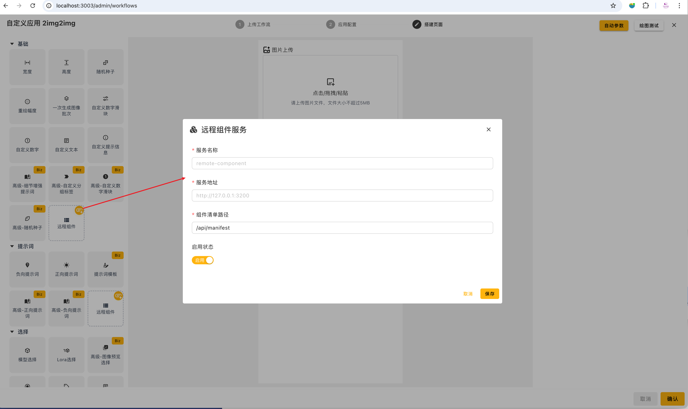
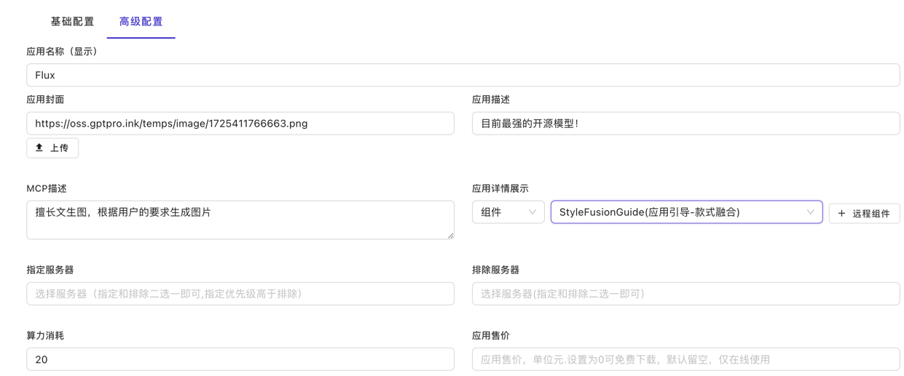

# EasyAI 插件开发脚手架

## 项目介绍

本项目支持以插件的方式为EasyAI平台提供组件服务，以实现对EasyAI平台前端组件库进行扩展，实现自定义组件以满足业务需求。

## 功能描述和核心功能

- 支持扩展AI应用封装组件库。例如提示词、图像上传等各种组件，还可以访问自己的私有化数据库等
- 支持扩展首页组件库。例如设计新的应用展示模块等其他各种功能。
- 支持应用引导组件库
- typescript类型支持

## 组件开发

### 项目启动

1. 安装依赖

```bash
pnpm install
```

2. 启动项目

```bash
pnpm dev
```

3. 访问地址：http://localhost:3201
4. 组件目录：components
5. 维护组件信息目录：manifest
6. 组件调试入口: app.vue
7. EasyAI平台，全局注入的数据和方法: types/common.ts
    1. 注入的素材库数据：GlobalInjectMaterials
        - mock数据：composables/mock/material.data.ts
        - 在组件中使用：components/RecommendedImages.vue
          ```ts
          const { materials: materialList } =
              inject<GlobalInjectMaterials>(GlobalInjectKeyConst.AllMaterials, {
              materials: ref<IImageSource>([]),
              }) || {};
          ```
    2. 注入的上传文件方法：GlobalInjectUploadFileToOSS
        - 在组件中使用：components/drawPanne/ImageUpload.vue
          ```ts
          const { useUtilsUploadFileToOSS } = inject<GlobalInjectUploadFileToOSS>(
              GlobalInjectKeyConst.UploadFileToOSS,
              {
               useUtilsUploadFileToOSS: async (file: File | Blob, filename?: string) => "",
              },
           );
          ```
    3. 其他注入数据：用户信息、会员信息、具有权限的APP应用信息，公开的作品列表等
## 示例组件 （图片上传组件）

1. 组件位置：components/drawPanne/ImageUpload.vue  
   正常的nuxt(vue3)项目组件开发，直接在components文件夹下创建即可
2. 维护组件信息文件：manifest/ImageUpload.ts  
   需要参照IComponentMateInfo类型约束文件进行定义

```typescript
export default {
    name: "DrawImageUpload", // 组件名称
    path: "./components/drawPanne/ImageUpload.vue", // 组件路径
    scenes: ComponentSceneConst.DrawPanne, // 组件场景
    description: "A image upload component", // 组件描述
    data: { // 组件数据
        paramName: "upload_image_path", // 参数名称
        label: "图片上传", // 组件标签
        icon: "icon-park:upload-picture", // 组件图标
        group: ComponentGroupConst.IMAGE, // 组件分组
        isRefComponent: true, // 是否为引用组件 （引用组件，在执行绘画的时候会执行参数赋值操作）
    },
} satisfies IComponentMateInfo;
```

3. 组件调试入口：app.vue

```text
<template>
  <div class="remote-ui">
    <!--    调试对象-->
    <DrawPanneImageUpload />
  </div>
</template>
<script lang="ts" setup>
import {
  GlobalInjectKeyConst,
  type GlobalInjectMaterials,
} from "~/types/common";
import { MockMaterials } from "~/composables/mock/material.data";

const materialData = ref(MockMaterials);
/**
 * EasyAI平台，已全局注入素材库库信息这里，开发环境使用mock数据用于调试
 */
provide<GlobalInjectMaterials>(GlobalInjectKeyConst.AllMaterials, {
  materials: materialData,
  refreshMaterials: async () => [],
});
</script>
```

## 测试环境部署

1. 打包

```bash
pnpm build
```

2. 启动项目

```bash
pnpm serve
```

3. 访问

```bash
http://localhost:3200
```

## 生产环境部署
1. 打包

```bash
pnpm build
```

2. 复制构建产物目录`.output`，`pm2.config.js`到服务器
3. 在服务器上安装node、pm2（具体安装方式请自行搜索）
4. 使用nginx代理项目/plugins/ 路由到项目端口`3020`

## 使用

- 在EasyAI平台上使用插件（可以在应用设置-高级配置-应用详情页展示，搭建页面和自定义页面样式三个场景下使用插件）
  


