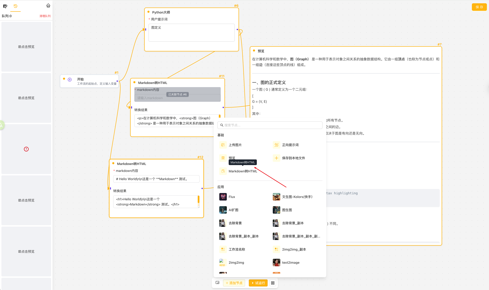
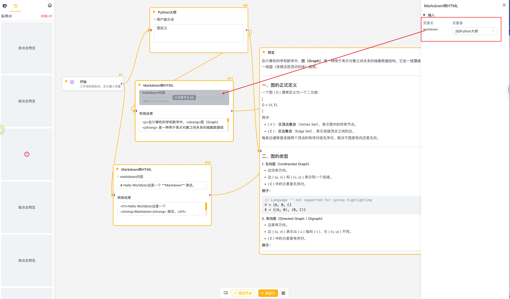

# 工作流节点开发文档
> 参考示例：Markdown2HTML节点

## 节点入口文件
> composables/worklfow/node/Markdown2HtmlNode.ts   
> 此文件定义了节点所需要的所有内容
- nodeType 节点类型
- getNodeList 节点清单，对应添加节点时，显示的内容
- initData 初始化数据，当前的插件节点，后端逻辑都是通过接口处理的
  - 示例接口：`server/api/markdown2html.post.ts` **注意返回结果类型：NodeOutput**
- createOutputSpec 定义参数关联节点产出的路径
  - 文本类型为 ['output_content', '*', 'content']
  - 媒体类型为 ['output_content', '*', 'url']
- renderNode: 节点对应的前端组件`components/Markdown2Html/index.vue`

```typescript
import { NodeCategoryEnum, PluginBaseNode } from "./PluginBaseNode";
import {
  Markdown2Html
} from '#components'

import { NodeTypeEnum } from "~/composables/worklfow/node/node.interface";

export default class Markdown2HtmlNode extends PluginBaseNode {
  static override nodeType = NodeTypeEnum.Markdown2Html // 节点类型

  static override getNodeList() {
    return [
      {
        type: Markdown2HtmlNode.nodeType, // 节点类型
        label: 'Markdown转HTML',          // 标签
        description: 'Markdown转HTML',    // 描述
        category: NodeCategoryEnum.BASE,  // 分类
        icon: 'material-symbols-light:markdown-paste' // 图标
      }
    ]
  }

  initData() {
    // 数据类型 IApiPluginNodeData
    return {
      method: 'POST', // 请求方法
      url: 'http://localhost:3200/plugins/api/markdown2html', // 请求地址，节点的业务逻辑，需要在接口中完成
      body: {
        markdown: '' // 接口请求体内容，输入的markdown内容
      },
      headers: {
        'Content-Type': 'application/json'
        // 依据接口自行扩展，认证等信息
      }
    } // 初始化数据
  }

  /**
   * 输入信息关联父节点产出的数据类型及数据路径
   */
  override createOutputSpec(): INodeOutputSpec {
    return {
      type: 'text', // 文本类型
      defaultPath: ['output_content', '*', 'content'] // 数据路径，文本为 ['output_content', '*', 'content']，媒体类型为 ['output_content', '*', 'url']
    }
  }

  // 画布节点 UI
  static override renderNode() {
    return Markdown2Html // 节点组件
  }
}
```


## 维护组件信息文件：
> manifest/Markdown2HtmlNode.ts  
> 需要参照IComponentMateInfo类型约束文件进行定义


## 组件效果

1. 添加节点  

2. 关联节点



